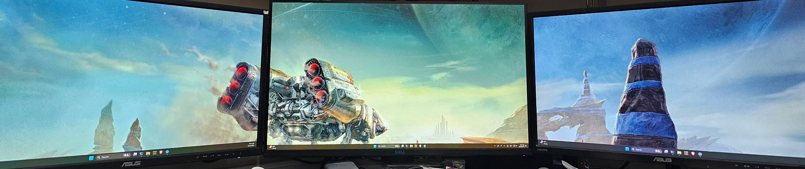
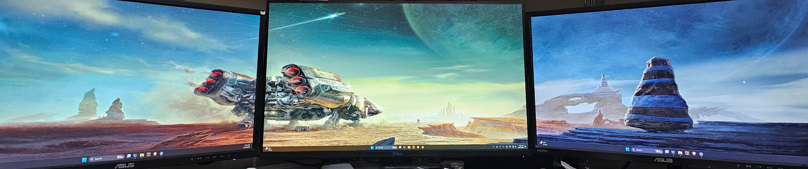
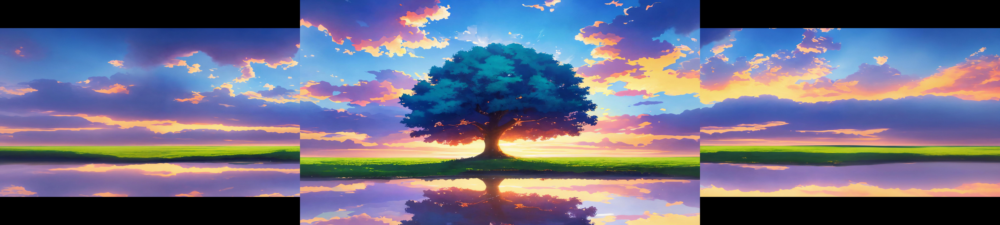
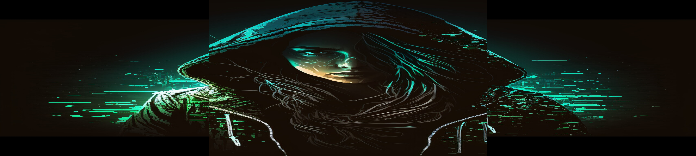
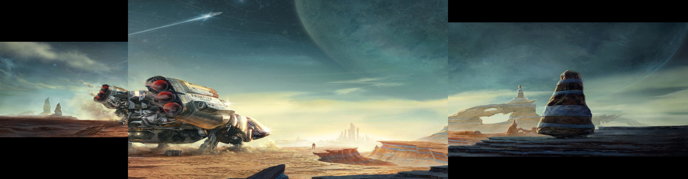

# Multi-Monitor Background Image Resizer
Uses OpenCV to resize wallpaper for use on multimonitors.

This is meant for when you have 2,3 or more monitors with different(or same) resolutions
but would like to place a multi-monitor image on them and have it displayed correctly.
It defaults to a 3 monitor setup where the 2 side monitors are 1920x1080 and the center is 2560x1440.

Proper sized images can easily be found by searching google.  
For example triple monitor, 1920*3x1080 `5760x1080 background [insert search terms here]`  
It works surprisingly well to convert dual monitor backgrounds to triple monitor too.
  
However any image size will work... see example at bottom for how it handles this.
  
Currently only for monitors arranged horizontally.(if you have a suggestion for vertical let me know)

## Setup
* `poetry install`  
If you are not familiar with poetry it will create a venv and install to that as to not mess up your system python packages you may need to `pip install poetry` first.

## Run
* python main.py [image_file]
* * It will show you the output before it saves, simply press any key on preview to close and save or close the window/press q to not save.
* * image_file can be any size it will split into desired_resolution[x] images then resize/add borders to top/bottom as needed.
* for help `python main.py -h`  

```
usage: main.py [-h] [-mr MONITOR_RES] [-o OUTPUT] [-m] [--overwrite] image

positional arguments:
  image                 Image to split up

options:
  -h, --help            show this help message and exit
  -mr MONITOR_RES, --monitor_res MONITOR_RES
                        Enter in your monitor resolution[s] '1920x1080' multiple -mr for
                        multiple monitors default = '-mr 1920x1080 -mr 2560x1440 -mr
                        1920x1080'
  -o OUTPUT, --output OUTPUT
                        Output filename eg '/tmp/image.jpg' (not for use with -m)
  -m, --multi_save      Save each split image to its own file.
  --overwrite           Overwrite original image file
```

## Package to Binary
`poetry install --with dev`  
`pyinstaller --onefile main.py`  
binary will be in dist/main[.exe]

## Example Output
### With Windows Stretch and an image of 3840x1280(dual screen res)


### Used this program to stretch it to 6400x1440(triple screen res)
As you can see, the image is not zoomed in like it is with the windows method.


Keep in mind that when on an actual multi-monitor setup if your monitors are aligned then so is the image as it spans them.
### Vertical res larger than all monitors...
```
main.py image.jpg
Splitting into 3 images from 7680 x 2160
Image 0: Desired = [1920, 1080]  Current = [2560, 2160]
        Resizing...
        Resized to: [1920, 1080]
        Adding Border to Height(centered)

Image 1: Desired = [2560, 1440]  Current = [2560, 2160]
        Resizing...
        Resized to: [2560, 1440]

Image 2: Desired = [1920, 1080]  Current = [2560, 2160]
        Resizing...
        Resized to: [1920, 1080]
        Adding Border to Height(centered)
Saved to: image_6400x1440.jpg
```

<sub><sup>Credit: https://www.reddit.com/r/WidescreenWallpaper/comments/1579dpa/art_tree_on_the_field_7680_x_2160/</sub></sup>

### Any Size image should work...
#### Here is a weirdly sized single monitor bg image(actually produces a neat result)
```
main.py image.jpg -o example/example_female_hacker_6400x1440.jpg
Splitting into 3 images from 1536 x 1024
Image 0: Desired = [1920, 1080]  Current = [512, 1024]
        Resizing...
        Resized to: [1920, 1080]
        Adding Border to Height(centered)
Image 1: Desired = [2560, 1440]  Current = [512, 1024]
        Resizing...
        Resized to: [2560, 1440]
Image 2: Desired = [1920, 1080]  Current = [512, 1024]
        Resizing...
        Resized to: [1920, 1080]
        Adding Border to Height(centered)
Saved to: image_6400x1440.jpg
```

<sub><sup>Credit: Uknown</sub></sup>

### 3 different sized monitors...
```
main.py 1329928.jpg -mr 1024x768 -mr '2560x1440' -mr '1920x1080' -o example/example_diff_sizes.jpg
Splitting into 3 images from 3840 x 1280
Image 0: Desired = [1024, 768]   Current = [1280, 1280]
        Resizing...
        Resized to: [1024, 768]
        Adding Border to Height(centered)
Image 1: Desired = [2560, 1440]  Current = [1280, 1280]
        Resizing...
        Resized to: [2560, 1440]
Image 2: Desired = [1920, 1080]  Current = [1280, 1280]
        Resizing...
        Resized to: [1920, 1080]
        Adding Border to Height(centered)
Saved to: example/example_diff_sizes.jpg
```

<sub><sup>Credit: Uknown</sub></sup>

